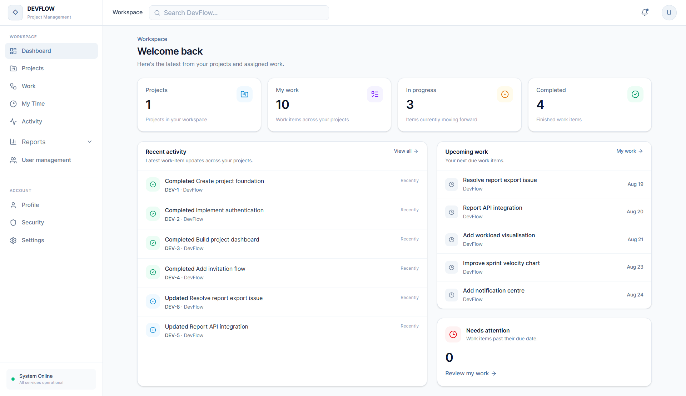
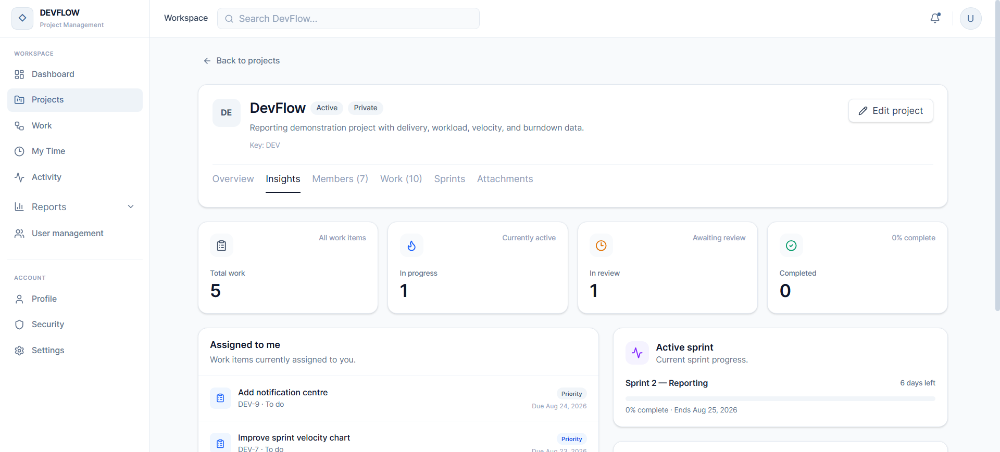
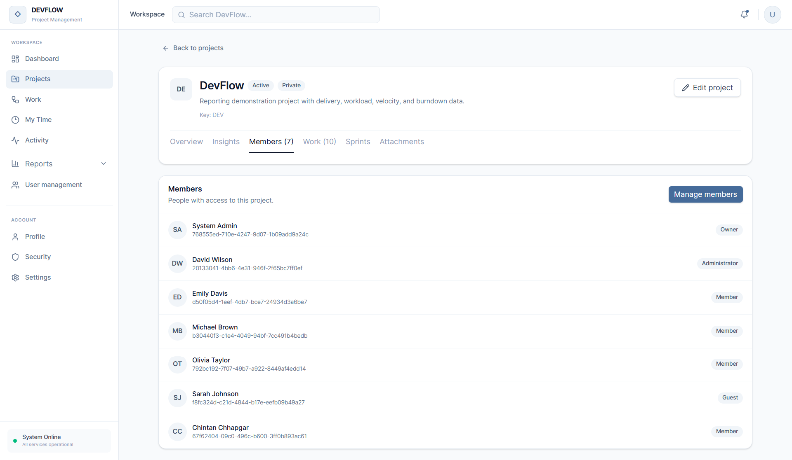
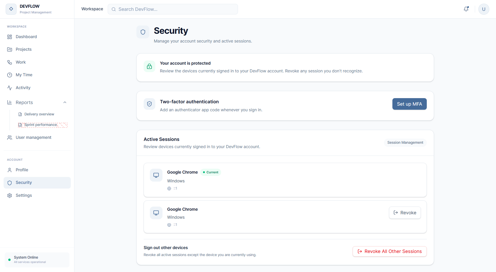

<div align="center">

# 🚀 DevFlow

### Modern Project Management & Agile Delivery Platform

[](https://dotnet.microsoft.com/)
[](https://react.dev/)
[](https://www.typescriptlang.org/)
[](https://www.postgresql.org/)
[](https://www.rabbitmq.com/)
[](https://masstransit.io/)
[](https://vite.dev/)
[](LICENSE)

**Plan projects, manage Agile work, collaborate with your team, track time, and measure delivery — all in one platform.**

[GitHub Repository](https://github.com/chintanchhapgar/DevFlow)

</div>

---

## ⚠️ Note

> DevFlow is a full-stack portfolio project built to demonstrate modern software architecture, domain-driven design, event-driven communication, authentication, Agile project management, reporting, and production-oriented engineering practices.
>
> The repository is currently configured primarily for local development. Development credentials, demo users, local database settings, and development HTTPS endpoints should **not** be used in production.

---

## ✨ Features

### 🎯 Project Management

* 📁 **Project management** - Create, update, archive, and restore projects
* 👥 **Project members** - Manage project membership and roles
* 📨 **Project invitations** - Invite users and accept/decline invitations
* 📌 **Project dashboard** - Centralized project overview
* 📈 **Project insights** - Delivery and project-level analytics
* 📚 **Project resources** - Centralized project resources

### 📋 Agile Work Management

* 📝 **Work items** - Create, update, assign, and manage work
* 🐛 **Multiple work item types** - Support for Agile work item categorization
* 🚦 **Status management** - Move work through different workflow states
* 🔥 **Priority management** - Track work item priority
* 👤 **Assignment** - Assign work to team members
* 🌳 **Parent/child work items** - Organize related work
* 🏷️ **Labels** - Categorize and filter work
* 💬 **Comments** - Collaborate directly on work items
* 📎 **Attachments** - Attach files to work items
* 📅 **Due dates & estimates** - Plan delivery

### 🏃 Sprint Management

* 🏃 **Sprint planning** - Create and manage sprints
* ▶️ **Start / complete sprints** - Manage sprint lifecycle
* 📊 **Sprint boards** - Visualize sprint work
* 📉 **Burndown reports** - Track sprint progress
* ⚡ **Velocity tracking** - Measure team delivery
* 🗂️ **Backlog management** - Move work between backlog and sprints
* 🎯 **Epics** - Organize larger bodies of work

### ⏱️ Time Tracking

* ⏱️ **Work timers** - Start and stop active work sessions
* 📝 **Worklogs** - Record time spent on work items
* 📊 **Time summaries** - Review logged time
* 👤 **My Time** - Personal time tracking
* 🔄 **Edit/delete worklogs** - Correct recorded time

### 📊 Reports & Analytics

* 📈 **Project reports**
* 📊 **Project summary**
* 👥 **Team workload**
* ⚡ **Velocity reports**
* 📉 **Sprint burndown**
* ⏱️ **Worklog analytics**
* 📦 **Delivery insights**
* 📋 **Sprint reports**

### 🔐 Authentication & Security

* 🔑 **JWT authentication**
* 🔄 **Refresh tokens**
* 📧 **Email verification**
* 🔁 **Password reset**
* 🔒 **Password change**
* 🛡️ **Multi-factor authentication**
* 🔢 **TOTP-based MFA**
* 🧾 **MFA recovery codes**
* 💻 **Session management**
* 🚪 **Session revocation**
* 🔐 **Role-based authorization**
* 📝 **Security event tracking**
* 🚫 **Account lockout protection**

### 👤 User Management

* 👥 **User management**
* 🔎 **User search**
* 🧑‍💼 **User roles**
* 👤 **User profiles**
* 🔐 **Security settings**
* 📱 **Active sessions**
* 🔔 **Notifications**

### 📨 Event-Driven Notifications

* 📨 **RabbitMQ messaging**
* 🔄 **MassTransit**
* 📬 **Integration events**
* 📦 **Transactional outbox**
* ⚙️ **Background outbox processing**
* 📧 **SMTP email delivery**
* 🔔 **Application notifications**

---

## 🛠️ Tech Stack

### Frontend


### Backend


### Database & Messaging


### Architecture & Infrastructure


---

## 🏗️ Architecture

DevFlow follows a **modular service-oriented architecture** with Domain-Driven Design, CQRS-style application handling, transactional outbox messaging, and clear separation between API, application, domain, and infrastructure layers.

```text
┌─────────────────────────────────────────────────────────────┐
│                         User Browser                        │
└────────────────────────────┬────────────────────────────────┘
                             │
                             ▼
                 ┌───────────────────────┐
                 │    React Frontend     │
                 │  React 19 + TypeScript│
                 │     Vite + Tailwind   │
                 └───────────┬───────────┘
                             │
                ┌────────────┴─────────────┐
                │                          │
                ▼                          ▼
       ┌──────────────────┐       ┌────────────────────┐
       │   Identity API   │       │    Project API     │
       │   ASP.NET Core   │       │    ASP.NET Core    │
       │                  │       │                    │
       │ • Authentication │       │ • Projects         │
       │ • JWT            │       │ • Work Items       │
       │ • MFA            │       │ • Sprints          │
       │ • Users          │       │ • Backlog          │
       │ • Sessions       │       │ • Reports          │
       └────────┬─────────┘       │ • Worklogs         │
                │                 └─────────┬──────────┘
                │                           │
                ▼                           ▼
       ┌──────────────────┐       ┌────────────────────┐
       │ Identity DB      │       │    Project DB      │
       │   PostgreSQL     │       │     PostgreSQL     │
       └──────────────────┘       └─────────┬──────────┘
                                             │
                                             │ Integration Events
                                             ▼
                                   ┌────────────────────┐
                                   │     RabbitMQ       │
                                   │    MassTransit     │
                                   └─────────┬──────────┘
                                             │
                                             ▼
                                   ┌────────────────────┐
                                   │ Notification API   │
                                   │    ASP.NET Core    │
                                   │                    │
                                   │ • Notifications    │
                                   │ • Email delivery   │
                                   └─────────┬──────────┘
                                             │
                                             ▼
                                   ┌────────────────────┐
                                   │ Notification DB    │
                                   │     PostgreSQL     │
                                   └────────────────────┘
```

---

## 🧩 Backend Architecture

Each major backend service follows a layered architecture:

```text
┌──────────────────────────────────────────────┐
│                    API                       │
│        HTTP / Endpoints / Middleware         │
└──────────────────────┬───────────────────────┘
                       │
                       ▼
┌──────────────────────────────────────────────┐
│                Application                   │
│       Commands / Queries / Handlers          │
│          Validation / Use Cases              │
└──────────────────────┬───────────────────────┘
                       │
                       ▼
┌──────────────────────────────────────────────┐
│                   Domain                     │
│      Aggregates / Entities / Events          │
│        Value Objects / Errors                │
└──────────────────────┬───────────────────────┘
                       │
                       ▼
┌──────────────────────────────────────────────┐
│                Infrastructure                │
│       EF Core / PostgreSQL / Messaging       │
│      Repositories / Storage / Outbox         │
└──────────────────────────────────────────────┘
```

---

## 📦 Services

### 🔐 Identity Service

Responsible for:

* User registration
* Authentication
* JWT tokens
* Refresh tokens
* Password management
* Email verification
* MFA
* Recovery codes
* Sessions
* Security events
* User management

```text
src/Services/Identity/
├── DevFlow.Identity.API
├── DevFlow.Identity.Application
├── DevFlow.Identity.Contracts
├── DevFlow.Identity.Domain
├── DevFlow.Identity.Infrastructure
├── DevFlow.Identity.UnitTests
└── DevFlow.Identity.IntegrationTests
```

### 📁 Project Service

Responsible for:

* Projects
* Members
* Invitations
* Work items
* Sprints
* Backlog
* Boards
* Epics
* Labels
* Comments
* Attachments
* Worklogs
* Dashboards
* Reports

```text
src/Services/Project/
├── DevFlow.Project.Api
├── DevFlow.Project.Application
├── DevFlow.Project.Contracts
├── DevFlow.Project.Domain
├── DevFlow.Project.Infrastructure
├── DevFlow.Project.UnitTests
└── DevFlow.Project.IntegrationTests
```

### 🔔 Notification Service

Responsible for:

* Notifications
* Email notifications
* SMTP integration
* Notification persistence
* Event consumers

```text
src/Services/Notification/
├── DevFlow.Notification.Api
├── DevFlow.Notification.Application
├── DevFlow.Notification.Contracts
├── DevFlow.Notification.Domain
├── DevFlow.Notification.Infrastructure
├── DevFlow.Notification.UnitTests
└── DevFlow.Notification.IntegrationTests
```

---

## 📸 Screenshots

> Add your application screenshots under `docs/screenshots/` and update these paths.

### 🏠 Dashboard



### 📁 Project Insight



### 📋 Project Member



### 🏃 Sprint Management


### 📊 Reports


### ⏱️ Time Tracking


### 🔐 Security & MFA



---

## 🚀 Getting Started

### Prerequisites

Make sure the following are installed:

* .NET 8 SDK
* Node.js
* npm
* PostgreSQL
* RabbitMQ
* Git
* Docker Desktop *(recommended for integration tests)*

Verify your installations:

```bash
dotnet --version
node --version
npm --version
```

---

## 1️⃣ Clone the Repository

```bash
git clone https://github.com/chintanchhapgar/DevFlow.git
cd DevFlow
```

---

## 2️⃣ Configure PostgreSQL

DevFlow uses separate PostgreSQL databases for the main services:

```text
devflow_identity
devflow_project
devflow_notification
```

Create them:

```sql
CREATE DATABASE devflow_identity;
CREATE DATABASE devflow_project;
CREATE DATABASE devflow_notification;
```

The development configuration uses PostgreSQL on:

```text
Host: localhost
Port: 5432
Username: postgres
Password: postgres
```

If your PostgreSQL credentials are different, update the development configuration or use environment-specific configuration.

---

## 3️⃣ Configure RabbitMQ

DevFlow uses RabbitMQ with MassTransit for asynchronous communication.

Default development configuration:

```text
Host: localhost
Port: 5672
Username: guest
Password: guest
Virtual Host: /
```

Make sure RabbitMQ is running before starting the services.

---

## 4️⃣ Apply Database Migrations

Install EF Core CLI if required:

```bash
dotnet tool install --global dotnet-ef --version 8.0.20
```

### Identity Database

```bash
dotnet ef database update \
  --project src/Services/Identity/DevFlow.Identity.Infrastructure \
  --startup-project src/Services/Identity/DevFlow.Identity.API
```

### Project Database

```bash
dotnet ef database update \
  --project src/Services/Project/DevFlow.Project.Infrastructure \
  --startup-project src/Services/Project/DevFlow.Project.Api
```

### Notification Database

```bash
dotnet ef database update \
  --project src/Services/Notification/DevFlow.Notification.Infrastructure \
  --startup-project src/Services/Notification/DevFlow.Notification.Api
```

---

## 5️⃣ Start the Backend

Restore dependencies:

```bash
dotnet restore
```

Build the solution:

```bash
dotnet build
```

### Identity API

```bash
dotnet run --project src/Services/Identity/DevFlow.Identity.API
```

### Project API

```bash
dotnet run --project src/Services/Project/DevFlow.Project.Api
```

### Notification API

```bash
dotnet run --project src/Services/Notification/DevFlow.Notification.Api
```

---

## 6️⃣ Start the Frontend

Open a new terminal:

```bash
cd frontend/DevFlow.Web
```

Install dependencies:

```bash
npm install
```

The development environment uses:

```env
VITE_API_BASE_URL=https://localhost:7205
VITE_PROJECT_API_BASE_URL=https://localhost:7110
```

Start the frontend:

```bash
npm run dev
```

Open:

```text
http://localhost:5173
```

---

## 🌐 Local Development URLs

| Service             | URL                      |
| ------------------- | ------------------------ |
| 🌐 Frontend         | `http://localhost:5173`  |
| 🔐 Identity API     | `https://localhost:7205` |
| 📁 Project API      | `https://localhost:7110` |
| 🔔 Notification API | `https://localhost:7158` |
| 🚪 API Gateway      | `https://localhost:7151` |

### Swagger

Identity API:

```text
https://localhost:7205/swagger
```

Notification API:

```text
https://localhost:7158/swagger
```

> The current API Gateway project is a placeholder and is not currently configured as the reverse proxy used by the frontend.

---


## 🗃️ Reporting Demo Data

The repository contains a development reporting reset script:

```text
database/reset-devflow-reports.sql
```

It can be used to recreate development reporting data for the project database.

Example:

```bash
psql -U postgres -d devflow_project -f database/reset-devflow-reports.sql
```

> ⚠️ This script is destructive and should only be used against development/test databases.

---

## 🧪 Testing

DevFlow includes unit tests, integration tests, and architecture tests.

Run all tests:

```bash
dotnet test
```

### Identity Tests

```bash
dotnet test src/Services/Identity/DevFlow.Identity.UnitTests
```

```bash
dotnet test src/Services/Identity/DevFlow.Identity.IntegrationTests
```

### Project Tests

```bash
dotnet test src/Services/Project/DevFlow.Project.UnitTests
```

```bash
dotnet test src/Services/Project/DevFlow.Project.IntegrationTests
```

### Notification Tests

```bash
dotnet test src/Services/Notification/DevFlow.Notification.UnitTests
```

```bash
dotnet test src/Services/Notification/DevFlow.Notification.IntegrationTests
```

### Architecture Tests

```bash
dotnet test tests/ArchitectureTests
```

Integration tests use Testcontainers infrastructure where required.

---

## 🎨 Frontend Commands

From:

```text
frontend/DevFlow.Web
```

### Development

```bash
npm run dev
```

### Production Build

```bash
npm run build
```

### Lint

```bash
npm run lint
```

### Preview Production Build

```bash
npm run preview
```

---

## 🔌 API Overview

### 🔐 Authentication

```text
POST /api/auth/login
POST /api/auth/logout
POST /api/auth/register
POST /api/auth/refresh
POST /api/auth/change-password
POST /api/auth/forgot-password
POST /api/auth/reset-password
GET  /api/auth/profile
GET  /api/auth/verify-email
POST /api/auth/resend-verification
```

### 🛡️ MFA

```text
POST /api/auth/mfa/setup
POST /api/auth/mfa/verify
POST /api/auth/mfa/disable
POST /api/auth/mfa/login
POST /api/auth/mfa/recovery-codes/regenerate
```

### 💻 Sessions

```text
GET    /api/auth/sessions
DELETE /api/auth/sessions/{sessionId}
DELETE /api/auth/sessions/others
DELETE /api/auth/sessions
```

### 📁 Projects

```text
GET  /api/projects
POST /api/projects
GET  /api/projects/{projectId}
PUT  /api/projects/{projectId}

POST /api/projects/{projectId}/archive
POST /api/projects/{projectId}/restore
```

### 📋 Work Items

```text
GET    /api/projects/{projectId}/work-items
POST   /api/projects/{projectId}/work-items

GET    /api/work-items/{workItemId}
PUT    /api/work-items/{workItemId}
DELETE /api/work-items/{workItemId}

PUT /api/work-items/{workItemId}/status
PUT /api/work-items/{workItemId}/priority
PUT /api/work-items/{workItemId}/assign
PUT /api/work-items/{workItemId}/sprint
```

### 🏃 Sprints

```text
GET    /api/projects/{projectId}/sprints
POST   /api/projects/{projectId}/sprints

GET    /api/sprints/{sprintId}
PUT    /api/sprints/{sprintId}
DELETE /api/sprints/{sprintId}

POST /api/sprints/{sprintId}/start
POST /api/sprints/{sprintId}/complete
```

### ⏱️ Worklogs

```text
GET    /api/work-items/{workItemId}/worklogs
GET    /api/work-items/{workItemId}/worklogs/summary

POST   /api/worklogs
PUT    /api/worklogs/{worklogId}
DELETE /api/worklogs/{worklogId}

POST /api/worklogs/start
POST /api/worklogs/stop
```

### 📊 Reports

```text
GET /api/projects/{projectId}/dashboard

GET /api/projects/{projectId}/reports/summary
GET /api/projects/{projectId}/reports/workload
GET /api/projects/{projectId}/reports/velocity

GET /api/sprints/{sprintId}/reports/burndown
```

---

## 📨 Event-Driven Architecture

DevFlow uses a transactional outbox pattern to reliably publish domain/integration events.

```text
┌───────────────────┐
│  Domain Operation │
└─────────┬─────────┘
          │
          ▼
┌───────────────────┐
│   PostgreSQL DB   │
│                   │
│ Business Data +   │
│ Outbox Message    │
└─────────┬─────────┘
          │
          ▼
┌───────────────────┐
│ Outbox Processor  │
└─────────┬─────────┘
          │
          ▼
┌───────────────────┐
│    MassTransit    │
└─────────┬─────────┘
          │
          ▼
┌───────────────────┐
│     RabbitMQ      │
└─────────┬─────────┘
          │
          ▼
┌───────────────────┐
│ Notification API  │
└───────────────────┘
```

This architecture helps keep database changes and published events consistent.

---

## 🔒 Security Highlights

* 🔐 JWT bearer authentication
* 🔄 Refresh token support
* 🔑 Password hashing
* 🛡️ TOTP-based MFA
* 🧾 Recovery codes
* 💻 Session tracking
* 🚪 Session revocation
* 🚫 Account lockout
* 📧 Email verification
* 🔄 Password reset
* ✅ FluentValidation
* 🛡️ Role-based authorization
* 🔒 HTTPS development support
* 📝 Security event tracking

---

## 📈 Observability

DevFlow includes centralized observability building blocks using:

* 📝 Serilog
* 📊 OpenTelemetry
* 🔎 ASP.NET Core instrumentation
* 🌐 HTTP instrumentation
* 🗄️ Entity Framework instrumentation
* ⚙️ Runtime instrumentation
* ❤️ PostgreSQL health checks
* 🐇 RabbitMQ health checks
* 🔴 Redis health-check support

The architecture is designed to make logging, tracing, and infrastructure monitoring consistent across services.

---

## 🧪 Code Quality

The solution uses centralized build configuration through:

```text
Directory.Build.props
Directory.Packages.props
```

The backend enables:

* Nullable reference types
* Implicit usings
* Treat warnings as errors
* Static code analysis
* Code-style enforcement
* Deterministic builds
* Central package version management

Frontend quality is enforced with ESLint and TypeScript compilation.

---

## 📁 Project Structure

```text
DevFlow/
│
├── database/
│   └── reset-devflow-reports.sql
│
├── frontend/
│   └── DevFlow.Web/
│       ├── public/
│       ├── src/
│       │   ├── app/
│       │   ├── components/
│       │   └── features/
│       │       ├── activity/
│       │       ├── auth/
│       │       ├── dashboard/
│       │       ├── profile/
│       │       ├── projects/
│       │       ├── reports/
│       │       ├── security/
│       │       ├── settings/
│       │       ├── time/
│       │       └── users/
│       │
│       ├── package.json
│       ├── vite.config.ts
│       └── tsconfig.json
│
├── src/
│   │
│   ├── BuildingBlocks/
│   │   ├── DevFlow.BuildingBlocks.Api/
│   │   ├── DevFlow.BuildingBlocks.Contracts/
│   │   ├── DevFlow.BuildingBlocks.Infrastructure/
│   │   ├── DevFlow.BuildingBlocks.Messaging/
│   │   ├── DevFlow.BuildingBlocks.Observability/
│   │   ├── DevFlow.BuildingBlocks.Security/
│   │   └── DevFlow.SharedKernel/
│   │
│   ├── Gateway/
│   │   └── DevFlow.ApiGateway/
│   │
│   └── Services/
│       │
│       ├── Identity/
│       │   ├── DevFlow.Identity.API/
│       │   ├── DevFlow.Identity.Application/
│       │   ├── DevFlow.Identity.Contracts/
│       │   ├── DevFlow.Identity.Domain/
│       │   ├── DevFlow.Identity.Infrastructure/
│       │   ├── DevFlow.Identity.UnitTests/
│       │   └── DevFlow.Identity.IntegrationTests/
│       │
│       ├── Project/
│       │   ├── DevFlow.Project.Api/
│       │   ├── DevFlow.Project.Application/
│       │   ├── DevFlow.Project.Contracts/
│       │   ├── DevFlow.Project.Domain/
│       │   ├── DevFlow.Project.Infrastructure/
│       │   ├── DevFlow.Project.UnitTests/
│       │   └── DevFlow.Project.IntegrationTests/
│       │
│       └── Notification/
│           ├── DevFlow.Notification.Api/
│           ├── DevFlow.Notification.Application/
│           ├── DevFlow.Notification.Contracts/
│           ├── DevFlow.Notification.Domain/
│           ├── DevFlow.Notification.Infrastructure/
│           ├── DevFlow.Notification.UnitTests/
│           └── DevFlow.Notification.IntegrationTests/
│
├── tests/
│   └── ArchitectureTests/
│
├── DevFlow.slnx
├── Directory.Build.props
├── Directory.Packages.props
├── .gitignore
└── README.md
```

---

## 🎯 Key Highlights

### 🏗️ Architecture

* 🧱 Clean separation of API, Application, Domain, and Infrastructure
* 🎯 Domain-Driven Design principles
* 🔄 CQRS-style command/query handling with MediatR
* 📦 Transactional Outbox
* 📨 Event-driven architecture
* 🐇 RabbitMQ + MassTransit
* 🧩 Shared building blocks
* 🔌 Modular service boundaries

### 🔐 Security

* 🔑 JWT authentication
* 🔄 Refresh tokens
* 🛡️ MFA / TOTP
* 🧾 Recovery codes
* 🔒 Password hashing
* 💻 Session management
* 🚫 Account lockout
* 📧 Email verification
* 🔐 Role-based authorization

### 📊 Engineering

* 🧪 Unit testing
* 🔬 Integration testing
* 🐳 Testcontainers
* 🏛️ Architecture tests
* 📝 Structured logging
* 📡 OpenTelemetry
* ❤️ Health checks
* 🧹 Static analysis
* 📦 Central package management

### 🎨 Frontend

* ⚛️ React 19
* 📘 TypeScript
* ⚡ Vite
* 🎨 Tailwind CSS
* 🧩 shadcn/ui
* 🔄 TanStack React Query
* 🐻 Zustand
* 📝 React Hook Form
* ✅ Zod validation
* 🧭 React Router

---

## 🎓 What I Learned Building This

* 🏗️ Designing modular backend services with clear boundaries
* 🎯 Applying Domain-Driven Design principles
* 🔄 Implementing CQRS-style application workflows
* 📨 Building reliable event-driven communication
* 📦 Implementing the transactional outbox pattern
* 🐇 Working with RabbitMQ and MassTransit
* 🔐 Designing JWT authentication and MFA flows
* 💻 Building session management and security features
* 🗄️ Working with PostgreSQL and Entity Framework Core
* 🧪 Building integration tests with Testcontainers
* 🏛️ Enforcing architecture boundaries through automated tests
* 📊 Building Agile reporting and delivery analytics
* ⚛️ Building a feature-oriented React frontend
* 📡 Adding structured logging and distributed observability

---

## 💡 Future Improvements

* [ ] 🚪 Complete API Gateway reverse-proxy configuration
* [ ] 🐳 Add Docker Compose for one-command local development
* [ ] ☁️ Add production deployment configuration
* [ ] 🔔 Real-time notifications with SignalR
* [ ] 📊 Advanced real-time project analytics
* [ ] 🔍 Advanced work item search
* [ ] 📱 Mobile-responsive UX improvements
* [ ] 🌍 Internationalization
* [ ] 📦 Cloud object storage for attachments
* [ ] 🔐 External identity providers
* [ ] 📈 Advanced engineering metrics
* [ ] 🤖 AI-assisted project insights

---

## 🤝 Contributing

> This is primarily a personal portfolio project.
>
> Feel free to ⭐ star, 🍴 fork, explore the architecture, or use it as inspiration for your own projects.

If you do submit an improvement:

```bash
git checkout -b feature/my-feature

dotnet build
dotnet test

cd frontend/DevFlow.Web
npm run lint
npm run build
```

Then open a pull request with a clear description of the changes.

---

## 📄 License

This project is licensed under the MIT License.

See the [LICENSE](LICENSE) file for details.

---

## 👨‍💻 Author

**Chintan Chhapgar**

* 🐙 GitHub: [@chintanchhapgar](https://github.com/chintanchhapgar)
* 🔗 Repository: [DevFlow](https://github.com/chintanchhapgar/DevFlow)

---

<div align="center">

### 🚀 DevFlow

**Plan → Build → Collaborate → Track → Measure → Improve**

⭐ **If you like this project, consider giving it a star!** ⭐

Made with ❤️ and ☕ by **Chintan Chhapgar**

</div>
